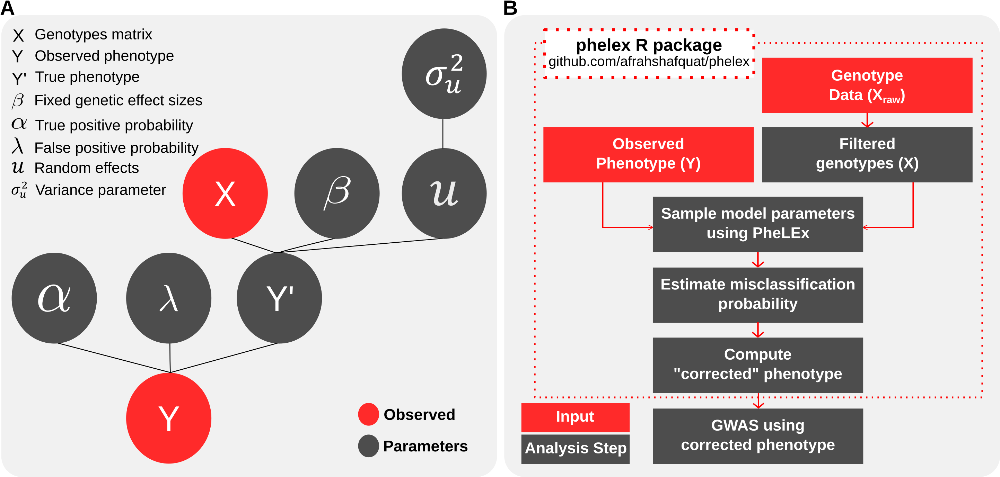

# PheLEx : (Phenotype Latent variable Extraction)

An R package for extracting differentially misclassified samples from GWAS phenotypes to improve statistical power of association analysis and identify novel disease-associated loci.

Useful applications include investigating GWAS phenotypes with lower statistical power or GWAS studies that fail to produce any results using traditional methodologies (i.e. Linear Mixed Model).

For more details, please refer to our paper [Identifying misclassified samples in GWAS phenotypes using PheLEx (in preparation)](http:://)

This repository includes four methods to extract misclassified samples from GWAS phenotypes and demo dataset to present a demonstration on how the method works. For this tutorial we only include documentation for PheLEx, the recommended method for extracting misclassifications. 

## Installation

You may install phelex using one of the following options. Pre-requisites for phelex are: R packages `modeest`, `truncdist`, `MASS` and `stats`. Please ensure these are installed before installing phelex.

1. Run devtools function `install_github("phelex","afrahshafquat")` in R/RStudio Console.
2. Download the git repository using `git clone http://github.com/afrahshafquat/phelex` and then in R/RStudio console install `phelex` using R devtools function `install("./phelex")` or `install.packages("./phelex", dependencies=TRUE)`.

## PheLEx Model and Pipeline



## Basic Usage

**Step 1**: Perform GWAS using your favourite program (e.g. [PLINK](http://zzz.bwh.harvard.edu/plink/), [GEMMA](http://www.xzlab.org/software.html), [lrgpr](http://lrgpr.r-forge.r-project.org/)).

**Step 2**: If GWAS produces statistically significant SNPs (according to Bonferroni-corrected p-value threshold), only provide those as input to PheLEx. Alternatively, you may use a reasonable p-value threshold or other information statistics to filter SNPs.

**Step 3**: You may use [PhenotypeSimulator](https://cran.r-project.org/web/packages/PhenotypeSimulator/index.html) or GEMMA to produce a relatedness/kinship matrix. Other software that do the same should be fine as well. *Please ensure that the matrix is positive-definite*

**Step 4**: Use PheLEx to extract misclassified samples. We provide the code below as an example to extract misdiagnosis in cases from GWAS phenotypes. *(Please note that there are several parameters in the method that can be customized according to the kind of analysis being pursued. The following is only to be considered as one of many different possibilties)*

```R
library(phelex)

# Load dataset
x = read.matrix('genotypes.txt')  # Genotypes should be in 0,1,2 format AND **filtered**
y = read.table('phenotype.txt')  # Phenotypes file
A = as.matrix(read.table('kinship_matrix.txt'))  # Kinship/Genetic relatedness matrix


# Extract misclassified samples
phelex.results = phelex(x = x,
                        y = y,
                        A = A,
                        alpha.prior = c(10, 1), # Beta prior for misclassification in controls (focuses PheLEx to extract overdiagnosis of phenotype rather than controls that might have disease),
                        iterations = 1e5)  # Total number of iterations for method to run
                        
misclassification_pr_cases = estimate_flip_probability(phelex.results$flip.cases)  # Misclassification probabilities estimated in cases
corrected_phenotype = get_phenotype(flip.p.cases = misclassification_pr_cases, y=y)  # Phenotype corrected using misclassification probabilities provided. With this command, only a fraction of cases will be switched to controls.
```

**Step 5**: Perform GWAS again using corrected phenotype.

## Optional parameters

* `alpha.prior and lambda.prior`: Beta Priors for true positive and false-positive rates respectively. Examples:
* * `alpha.prior` or `lambda.prior = c(1,1)` would give a more uniform Beta distribution with all misclassification rates in cases or controls being equally likely sampled. 
* * `alpha.prior= c(10, 1)` recommends that most true cases stay cases and are not switched to controls. This would extract overdiagnosis in cases, rather than discern misclassification in controls.
* * `lambda.prior= c(1, 4)` recommends that true controls may be observed as cases with rates usually between (0-0.25). 

* `beta.prior.params`: Prior on effect sizes of SNPs. The prior is normally-distributed by default (alt. uniform prior may be specified). You may want to change these parameters depending on prior knowledge about effect sizes.

For documentation on other parameters, please refer to documentation provided.

## Alternative methods

PheLEx encloses three methods other than PheLEx: 

1. PheLEx without mixed effects (**phelex_m**), 
2. Rekaya's method (**rekaya**)
3. PheLEx with Gibbs sampling instead of Adaptive Metropolis-Hastings within Gibbs (**phelex_mh**). 

Please refer to the manuscript and/or documentation for details on each method.
